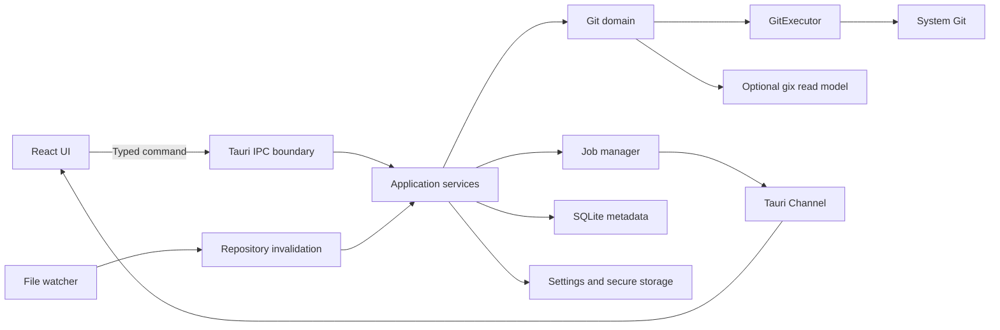

# GitAcorn 설계 및 구현 실행 계획

> 목표: Fork, GitKraken Desktop과 같은 크로스 플랫폼 Git GUI 클라이언트를 Tauri 2와 Rust로 개발한다.
>
> 실행 기준: Codex가 이 저장소에서 한 번에 하나의 수직 기능을 구현하고 검증한다. Windows를 첫 Alpha 플랫폼으로 삼고 macOS, Linux 순으로 확장한다. 달력 기반 예상보다 각 마일스톤의 검증 가능한 완료 조건을 우선한다.

## 1. 제품 방향

### 1.1 목표 사용자

- 터미널 Git을 사용할 수 있지만 반복 작업은 GUI로 빠르게 처리하고 싶은 개발자
- 변경 파일을 작은 단위로 검토하고 부분 스테이징하는 사용자
- 브랜치와 커밋 그래프를 시각적으로 탐색하는 사용자
- GitHub/GitLab 원격 저장소를 데스크톱에서 관리하려는 사용자

### 1.2 핵심 가치

1. **안전성**: 데이터 손실 가능성이 있는 동작은 미리 결과를 보여주고 복구 경로를 제공한다.
2. **정확성**: 사용자의 Git 설정, hooks, credential helper와 최대한 동일하게 동작한다.
3. **반응성**: 저장소가 커도 UI 입력과 스크롤은 멈추지 않는다.
4. **설명 가능성**: 실행할 Git 명령, 변경 범위, 오류 원인을 사용자가 확인할 수 있다.
5. **점진적 고급화**: 기본 작업은 단순하게, rebase/reset 같은 고급 기능은 필요할 때만 노출한다.

### 1.3 MVP 범위

- 로컬 저장소 열기, 최근 저장소, 새 저장소 초기화
- 여러 저장소를 한 창에서 열고 탭으로 전환·닫기·세션 복원
- 저장소별 worktree 목록 조회와 전환
- clone
- working tree 상태와 staged/unstaged/untracked 분리
- 파일, hunk, 선택 라인 단위 stage/unstage/discard
- unified 또는 split diff
- commit 작성 및 amend
- 브랜치 생성/전환/삭제
- 커밋 로그와 브랜치 그래프
- fetch/pull/push
- stash 생성/적용/삭제
- 충돌 파일 탐지와 기본 충돌 해결 흐름
- Git 실행 로그, 오류 표시, 작업 취소
- 앱 설정, 테마, 자동 업데이트

### 1.4 MVP 이후

- interactive rebase, cherry-pick, revert, reset UI
- commit drag & drop과 history rewrite
- worktree 생성·삭제·잠금, submodule, Git LFS
- GitHub/GitLab PR·이슈·CI 상태 연동
- SSH 키 관리와 내장 credential 저장소
- blame, reflog, bisect
- 다중 계정, 프로필별 Git 설정
- 플러그인 또는 확장 시스템
- AI 커밋 메시지·PR 설명 생성

MVP에서 PR 연동과 AI를 제외한다. 핵심 Git 작업의 신뢰성과 복구 경험이 먼저다.

## 2. 확정 기술 선택

| 영역 | 확정 선택 | 이유 |
|---|---|---|
| 데스크톱 런타임 | Tauri 2 | 작은 배포 크기, Rust 백엔드, OS WebView 활용 |
| 프런트엔드 | React + TypeScript + Vite | 복잡한 데스크톱 UI, 가상 스크롤, 에디터 생태계 활용 |
| 서버 상태 | TanStack Query | Rust 명령의 캐시·재조회·오류 상태 관리 |
| 로컬 UI 상태 | Zustand | 선택 파일, 패널 크기, 필터처럼 일시적인 상태 관리 |
| 스타일 | CSS Variables + CSS Modules | 테마와 네이티브에 가까운 밀도 제어 |
| 대형 목록 | TanStack Virtual | 파일 및 커밋 목록 가상화 |
| 코드/diff | 자체 라인 렌더러로 시작 | Monaco 전체 도입보다 가볍고 부분 스테이징 제어가 쉬움 |
| 비동기 런타임 | Tokio | Git 프로세스, 취소, 동시성 제어 |
| 직렬화 | serde | IPC DTO와 설정 파일 |
| 오류 | thiserror + tracing | 사용자 오류와 진단 정보를 분리 |
| 설정 | serde + JSON/TOML | 앱 전역 설정과 저장소별 UI 설정 |
| 로컬 DB | SQLite(sqlx) | 최근 저장소, 작업 이력, 캐시 메타데이터 |
| 테스트 | cargo test + Vitest + Playwright | 도메인, UI, 실제 Git 저장소 E2E 분리 |

프런트엔드를 Rust 기반 UI로 통일하는 선택도 가능하지만, diff·그래프·접근성·가상화 UI를 빠르게 완성하려면 TypeScript UI가 현실적이다. “Rust 중심”은 Git 도메인, 파일 시스템, 프로세스 실행, 보안 경계를 Rust가 소유한다는 의미로 정의한다.

## 3. Git 엔진 전략

### 3.1 확정안: 시스템 Git 우선, 선택적 `gix` 도입

초기 버전은 사용자의 시스템 `git` 실행 파일을 Rust에서 직접 호출한다.

- 장점
  - `.gitconfig`, credential helper, SSH, GPG, hooks와 높은 호환성
  - 최신 Git 기능을 별도 재구현하지 않아도 됨
  - 사용자가 터미널에서 재현 가능한 명령과 오류 제공
- 단점
  - 프로세스 실행과 출력 파싱 비용
  - 플랫폼별 인코딩, 인증 프롬프트, 취소 처리가 필요

읽기 성능이 중요한 경로는 측정 후 `gix`를 선택적으로 사용한다.

- 적합한 후보: object 탐색, commit graph, refs 조회, diff 보조
- 시스템 Git을 유지할 경로: clone/fetch/push, commit, rebase, hooks나 credential이 관여하는 쓰기 작업

MVP부터 시스템 Git과 `gix`를 같은 기능에 혼합하지 않는다. 서로 다른 구현이 같은 저장소 상태를 다르게 해석하면 디버깅 비용이 커진다. 성능 측정과 호환성 테스트를 통과한 읽기 경로만 하나씩 이전한다.

### 3.2 기계 파싱 규칙

- status: `git --no-optional-locks status --porcelain=v2 -z --branch --show-stash`
- diff: `git diff --no-ext-diff --no-color`와 `--cached`
- log: 구분자를 명시한 custom format과 `-z`
- refs: `for-each-ref`의 명시적 format 사용
- 사용자에게 보여 줄 메시지 외에는 사람이 읽는 기본 출력을 파싱하지 않는다.
- 파일명은 줄바꿈을 포함할 수 있으므로 가능하면 NUL 구분 출력을 사용한다.
- 명령은 shell 문자열이 아니라 executable + argument 배열로 실행한다.

### 3.3 Git 실행기 요구사항

`GitExecutor`는 모든 Git 호출의 단일 관문이다.

```rust
pub struct GitRequest {
    pub repo_id: RepoId,
    pub args: Vec<OsString>,
    pub operation: OperationKind,
    pub timeout: Option<Duration>,
    pub environment: BTreeMap<OsString, OsString>,
}

pub struct GitOutput {
    pub stdout: Vec<u8>,
    pub stderr: Vec<u8>,
    pub exit_code: i32,
    pub duration: Duration,
}
```

필수 정책:

- 저장소 경로 검증 및 canonicalization
- 명령별 timeout과 cancellation token
- `GIT_TERMINAL_PROMPT=0` 기본값. 인증은 별도 askpass 흐름으로 처리
- 민감 정보가 포함될 수 있는 URL·환경 변수 로그 마스킹
- 저장소별 **쓰기 작업 직렬화**
- 읽기 작업 동시성 제한
- destructive operation 직전 스냅샷 또는 undo 메타데이터 기록
- stdout/stderr streaming은 Tauri Channel로 전달

## 4. 전체 아키텍처



### 4.1 계층 책임

#### React UI

- 화면 렌더링, 키보드 탐색, 접근성
- 현재 선택·필터·패널 레이아웃
- Rust가 반환한 DTO 표현
- Git 규칙이나 경로 권한 판단을 직접 수행하지 않음

#### Tauri IPC

- 작고 명시적인 command API
- 입력 검증과 capability/permission 적용
- Rust domain type을 UI용 versioned DTO로 변환
- 장시간 작업은 `operation_id`와 Channel을 반환

#### Application services

- use case 조합: stage, commit, checkout, sync 등
- 쓰기 잠금과 작업 큐
- 상태 변경 후 cache invalidation
- 사용자 확인이 필요한 위험도 계산

#### Git domain

- repository, status, diff, commit, branch, remote 모델
- Git 출력 파서
- operation 사전 조건과 결과 분류
- Tauri나 React에 의존하지 않는 순수 Rust crate

#### Infrastructure

- 시스템 Git 프로세스
- file watcher
- SQLite
- OS keychain/Stronghold
- updater, logging, crash report opt-in

## 5. Rust 워크스페이스 구조

```text
GitAcorn/
├─ apps/
│  └─ desktop/
│     ├─ src/                     # React/TypeScript
│     ├─ src-tauri/
│     │  ├─ src/
│     │  │  ├─ commands/
│     │  │  ├─ dto/
│     │  │  ├─ state.rs
│     │  │  └─ lib.rs
│     │  ├─ capabilities/
│     │  └─ tauri.conf.json
│     └─ package.json
├─ crates/
│  ├─ git-domain/                 # Entity, parser, policy
│  ├─ git-cli/                    # GitExecutor, askpass, process control
│  ├─ app-core/                   # Use cases, jobs, cache, locks
│  ├─ persistence/                # SQLite and settings
│  └─ test-support/               # Temporary repository fixtures
├─ docs/
├─ Cargo.toml
└─ package.json
```

Tauri command 함수에 Git 로직을 직접 넣지 않는다. `src-tauri`는 조립과 IPC adapter만 담당해야 도메인 테스트와 향후 CLI 재사용이 쉬워진다.

## 6. 주요 도메인 모델

```text
ApplicationSession
├─ open_repositories: Vec<RepositoryTab>
├─ active_repo_id: RepoId
└─ active_page_by_repo: Map<RepoId, PageId>

RepositoryTab
├─ repo_id
├─ worktree_id
├─ tab_order
├─ selected_file
├─ selected_diff_kind: staged | unstaged
└─ page: changes | history

Repository
├─ identity: RepoId
├─ worktree_path
├─ git_dir
├─ head: unborn | detached | branch
├─ upstream: optional
└─ operation_state: clean | merging | rebasing | cherry_picking

Worktree
├─ identity: WorktreeId
├─ repo_id
├─ path
├─ head
├─ branch: optional
└─ is_locked

FileChange
├─ path / original_path
├─ index_status
├─ worktree_status
├─ conflict_stage
├─ is_submodule
└─ stats

Operation
├─ id
├─ repo_id
├─ kind
├─ state: queued | running | waiting_for_auth | succeeded | failed | cancelled
├─ progress
└─ diagnostic
```

### 6.1 저장소 식별

경로 문자열 자체를 ID로 사용하지 않는다. canonical path를 기반으로 안정적인 `RepoId`를 생성하고, case-insensitive 파일 시스템 및 symlink를 고려한다. 한 저장소에 여러 worktree가 있을 수 있으므로 `git_dir`와 `worktree_path`를 모두 보관한다.

### 6.2 상태 스냅샷

UI는 여러 개의 개별 API를 조합해 임의 상태를 만들지 않고, 다음처럼 하나의 일관된 스냅샷을 받는다.

```ts
type RepositorySnapshot = {
  revision: number;
  repository: RepositoryDto;
  head: HeadDto;
  upstream?: UpstreamDto;
  changes: FileChangeDto[];
  conflicts: ConflictDto[];
  stashCount: number;
  operationState: OperationStateDto;
};
```

쓰기 작업이 끝나면 `revision`이 증가한다. 이전 revision에 기반한 stage/checkout 요청은 Rust에서 거부하고 새 스냅샷을 요구한다. 이 방식으로 빠른 연속 클릭과 외부 터미널 변경에 따른 stale write를 방지한다.

### 6.3 다중 저장소 세션

- 열린 탭의 순서, 활성 저장소, 저장소별 마지막 페이지와 선택 파일을 SQLite에 저장한다.
- 각 탭은 반드시 `RepoId`와 현재 `WorktreeId`를 가진다. 화면에 보이는 경로 문자열로 상태를 연결하지 않는다.
- 탭 전환은 Git 작업을 취소하지 않는다. 진행 중인 작업은 저장소별 operation center에서 계속 추적한다.
- 탭을 닫아도 실행 중인 fetch/push 같은 작업은 사용자가 명시적으로 취소하지 않는 한 계속 실행한다.
- 앱 재시작 시 존재하는 경로만 복원하고, 이동되거나 삭제된 저장소는 복구 가능한 placeholder 탭으로 표시한다.
- 프런트엔드 캐시는 `repoId`를 최상위 query key로 사용해 다른 저장소의 snapshot이나 diff가 섞이지 않게 한다.

## 7. IPC API 초안

### 7.1 빠른 요청/응답

- `repository_open(path)`
- `session_restore()`
- `session_tabs_list()`
- `worktrees_list(repo_id)`
- `repository_snapshot(repo_id)`
- `diff_get(repo_id, target, options)`
- `history_page(repo_id, cursor, filters)`
- `branches_list(repo_id)`
- `tags_list(repo_id)`
- `stashes_list(repo_id)`
- `settings_get()` / `settings_update(patch)`

### 7.2 상태 변경

- `session_tab_activate(repo_id, worktree_id)`
- `session_tab_close(repo_id)`
- `session_tabs_reorder(repo_ids)`
- `worktree_activate(repo_id, worktree_id)`
- `stage_paths(repo_id, revision, paths)`
- `unstage_paths(repo_id, revision, paths)`
- `apply_patch(repo_id, revision, patch, target)` — 선택 라인/hunk의 stage 또는 unstage
- `commit_create(repo_id, revision, request)`
- `branch_checkout(repo_id, revision, name, strategy)`
- `remote_sync(repo_id, request, channel)`
- `operation_cancel(operation_id)`

### 7.3 규칙

- API 이름에 임의의 Git argument를 받는 범용 `run_git(args)`를 노출하지 않는다.
- 경로는 열려 있는 `RepoId`의 루트 내부인지 Rust에서 검증한다.
- 모든 repository-scoped command는 암묵적인 “현재 탭” 대신 `repo_id`를 명시적으로 받는다.
- DTO에는 `schemaVersion`을 두고 camelCase를 사용한다.
- 오류는 `code`, `message`, `details`, `recoveryActions`, `operationId`로 구조화한다.
- 진행률, 인증 요청, 장시간 로그는 Channel로 전송한다.
- 저장소 변경 알림처럼 작은 fan-out 메시지만 Tauri event로 전달한다.

## 8. 동시성, 캐시, 파일 감시

### 8.1 저장소별 작업 모델

- write queue: 저장소마다 1개, FIFO
- read pool: 앱 전체 제한 4~8개부터 시작
- UI의 같은 종류 read 요청은 이전 요청 취소 또는 deduplicate
- 탭 전환은 이전 저장소의 read 요청만 선택적으로 취소하고 write operation에는 영향을 주지 않음
- checkout/rebase 중 status watcher는 debounce
- 앱 밖에서 `.git/index`, refs, HEAD, working tree가 바뀌면 관련 캐시만 무효화

### 8.2 캐시

- L1 메모리: status snapshot, refs, diff page
- SQLite: 최근 저장소, 열린 탭 순서, 저장소별 UI 상태, operation history, 선택적 commit metadata
- Git object 자체를 SQLite에 복제하지 않음
- cache key에 repo ID, worktree ID, HEAD OID, index metadata, options 포함

### 8.3 대형 저장소 목표

- 100k commits: 첫 그래프 화면 1초 이내를 목표로 pagination
- 10k changed files: 목록 전체 DOM 생성을 금지하고 가상화
- 큰 diff: 파일 및 hunk pagination, 최대 렌더 라인 제한
- binary/대용량 파일: 메타데이터만 표시하고 명시적 로드

성능 수치는 CI benchmark 저장소에서 측정하며, 하드웨어별 절대 보장 대신 회귀 방지 기준으로 사용한다.

## 9. UX 정보 구조

```text
┌ App ──────────────────────────────────────────────────────────────────────┐
│ [GitAcorn · 4] [Atlas API · 2] [Design System · 7] [+ Open repository]   │
├───────────────────────────────────────────────────────────────────────────┤
│ Active repository / path / branch                Fetch · Pull · Push      │
├──────────────────────┬────────────────────────────────────────────────────┤
│ Changes              │ Changes page                                      │
│ History              │ ┌ Unstaged/Staged ┬ Diff ────────┬ Commit ┐       │
│                      │ │ file selection  │ line/hunk    │ form   │       │
│ Worktrees            │ └─────────────────┴──────────────┴────────┘       │
│ Branches (max 5)     │                                                    │
│ Tags (max 5)         │ History page                                      │
│ Stashes              │ ┌ Commit graph · refs · author · time ─────┐      │
│                      │ └────────────────────────────────────────────┘      │
└──────────────────────┴────────────────────────────────────────────────────┘
```

### 9.1 저장소 탭

- 한 창에서 여러 저장소를 열고 최상단 탭으로 전환한다.
- 탭에는 저장소명과 변경 파일 수를 표시한다. 경로 전체와 활성 branch는 탭 아래 context bar에서 보여 준다.
- `+` 버튼은 repository picker를 연다. 이미 열린 저장소를 선택하면 새 탭을 만들지 않고 기존 탭을 활성화한다.
- 탭 닫기는 저장소 자체나 진행 중 작업을 삭제하지 않는다. 미커밋 변경사항 때문에 탭 닫기를 막지 않는다.
- 마지막 탭은 닫을 수 있으며 이 경우 repository welcome 화면을 표시한다.
- 각 저장소는 Changes/History 위치, 선택 파일, diff 모드, 패널 크기를 독립적으로 기억한다.
- 탭의 변경 수와 ahead/behind는 백그라운드 snapshot 갱신 결과를 반영한다.
- 저장소가 많아지면 탭은 가로 스크롤 대신 overflow menu로 넘기고, 최근 사용 순으로 빠르게 찾을 수 있게 한다.

### 9.2 저장소 사이드바

- 최상단 navigation은 **Changes**와 **History** 두 항목으로 고정한다.
- Worktrees는 현재 저장소의 worktree를 표시하며 선택 시 같은 저장소 탭의 `WorktreeId`만 전환한다.
- Branches와 Tags는 접을 수 있다. 펼친 상태에서도 처음 5개만 표시하고 `5 of N`으로 전체 개수를 알린다.
- Branches의 기본 정렬은 current branch, 최근 checkout, local, remote 순이다.
- Tags의 기본 정렬은 semantic version 또는 작성일 내림차순이며 설정으로 바꿀 수 있다.
- Stashes는 최신 항목부터 표시하고 메시지와 `stash@{n}`을 식별할 수 있게 한다.
- branch/tag 전체 탐색과 검색은 사이드바를 무한히 늘리지 않고 별도 picker에서 제공한다.

### 9.3 Changes 페이지

- **Unstaged**와 **Staged** 목록을 Changes 페이지 내부에 동시에 둔다. 사이드바 navigation과 혼합하지 않는다.
- 두 목록의 파일은 모두 선택 가능하다.
  - Unstaged 파일 선택: working tree ↔ index diff, `Stage file/hunk/selected lines`
  - Staged 파일 선택: index ↔ HEAD diff, `Unstage file/hunk/selected lines`
- 같은 파일이 부분 staging 상태라면 Unstaged와 Staged 양쪽에 동시에 나타나며 `partial` 상태를 표시한다.
- 선택 라인 stage/unstage는 Rust가 생성·검증한 patch를 `git apply --cached` 또는 역방향 equivalent로 적용한다.
- patch 적용 후 같은 파일과 스크롤 위치를 유지하되, 최신 revision으로 diff를 다시 요청한다.
- commit pane에는 staged 파일만 표시하며 active repository의 branch명을 commit 버튼에 반영한다.

### 9.4 History 페이지

- lane 기반 commit graph, commit subject, abbreviated OID, branch/tag label, author, 상대 시간을 표시한다.
- 저장소 탭을 바꾸면 해당 저장소의 독립된 history cursor와 선택 commit을 복원한다.
- branch나 tag를 선택해도 자동 checkout하지 않고 History filter 또는 commit 선택만 변경한다.

### 9.5 원격 작업

- active repository context bar에 **Fetch → Pull → Push** 순서로 배치한다.
- Push에는 outgoing commit 수, Pull에는 incoming commit 수가 있을 때만 숫자를 표시한다.
- 탭을 전환하면 버튼의 대상 저장소와 카운트가 즉시 바뀐다.
- 실행 중인 작업은 해당 탭과 전역 operation center 모두에서 상태를 확인할 수 있다.

주요 보조 화면:

1. **Reference picker**: 전체 local/remote branches와 tags 검색
2. **Conflict**: ours/base/theirs와 결과, 해결 상태
3. **Operations**: 저장소별/전체 실행 작업, 로그, 취소, 실패 복구
4. **Repository picker**: 최근 저장소, 폴더 열기, clone, init

위험 동작은 세 단계로 분류한다.

| 위험도 | 예 | UX |
|---|---|---|
| 낮음 | fetch, stage | 즉시 실행, toast 및 undo 가능 시 제공 |
| 중간 | branch delete, discard hunk | 변경 범위와 확인 |
| 높음 | hard reset, force push, rebase abort | 대상 OID·손실 가능 변경 표시, 명시적 확인 |

## 10. 안전성과 보안

- WebView에 filesystem과 shell의 광범위한 권한을 부여하지 않는다.
- Tauri capability는 main window에 필요한 command만 허용한다.
- 사용자가 연 저장소만 session allowlist에 추가한다.
- remote URL, branch name, path를 shell interpolation하지 않는다.
- 외부 diff/merge tool은 기본 비활성화하고 실행 전 실제 command를 표시한다.
- token/password/private key는 로그, SQLite, 프런트 상태에 저장하지 않는다.
- 인증은 우선 OS/Git credential helper를 사용한다.
- 앱 자체 토큰 저장이 필요해지면 OS keychain 또는 Stronghold를 사용한다.
- updater는 서명 검증을 적용하고 HTTPS endpoint만 사용한다.
- CSP를 명시하고 remote content를 WebView DOM에 직접 삽입하지 않는다.
- crash report는 opt-in이며 path, URL, commit message를 제거한다.

### 10.1 복구 전략

- 쓰기 작업 전 현재 HEAD, branch, index 상태, operation kind를 기록
- 가능한 작업은 반대 명령이 아닌 reflog/OID 기반 복구 action 제공
- 앱이 충돌해도 다음 시작 시 진행 중이던 operation과 Git sequencer 상태 탐지
- destructive command 확인창에 “복구 가능 여부”를 명시
- 자체적인 무제한 undo는 MVP 이후 별도 설계. 초기에는 Git reflog와 안전 스냅샷을 이용

## 11. 오류 처리

오류는 사용자 메시지와 진단 정보를 분리한다.

```rust
pub enum AppError {
    RepositoryNotFound,
    StaleRevision { expected: u64, actual: u64 },
    DirtyWorktree { paths: Vec<PathBuf> },
    AuthenticationRequired { remote: RedactedUrl },
    Conflict { operation: OperationKind },
    GitFailed { class: GitErrorClass, diagnostic_id: Uuid },
    Cancelled,
}
```

- 사용자 메시지: 무엇이 실패했고 다음에 무엇을 할 수 있는지 설명
- 상세 보기: 마스킹된 명령, exit code, stderr, Git 및 앱 버전
- 복구 action: retry, fetch first, open conflicts, copy diagnostics
- raw stderr 문자열 비교는 최후 수단으로만 사용하고 exit code와 저장소 상태를 함께 분류

## 12. 테스트 전략

### 12.1 Rust

- parser golden test: status/log/diff의 NUL 출력, 특수 파일명, 비 UTF-8 경로
- domain unit test: stale revision, 위험도, operation state
- integration test: 임시 실제 저장소에서 stage/commit/branch/merge
- property test: path와 parser 경계값
- cancellation test: 장시간 fetch/credential 대기 종료

### 12.2 프런트엔드

- component test: 저장소 탭, Unstaged/Staged 파일 목록, diff hunk, graph row
- repository tab 전환 시 query key와 저장소별 선택 상태 격리 test
- 같은 파일의 partial staged/unstaged 동시 표시와 양방향 line selection test
- Branches/Tags 접기 및 최대 5개 표시 test
- keyboard/accessibility test
- query invalidation과 stale response test
- 10k 파일 및 대형 diff 가상화 성능 test

### 12.3 E2E와 호환성

- Playwright + Tauri driver가 안정적인 범위에서 핵심 happy path 자동화
- CLI 수준 integration test를 주력으로 하고 OS UI E2E는 소수 유지
- Windows NTFS, macOS APFS, Linux ext4
- Git 최소 지원 버전과 최신 버전
- HTTPS/SSH remote, credential helper, hooks, GPG signing
- worktree, submodule, bare repo는 지원 전이라도 “안전한 거부” 테스트

### 12.4 필수 fixture

- unborn branch
- detached HEAD
- merge/rebase/cherry-pick 진행 중
- rename/copy/type change
- symlink와 executable bit
- newline/space/unicode/non-UTF-8 파일명
- nested repository와 submodule
- 여러 열린 저장소와 여러 worktree
- 같은 파일에 staged와 unstaged 변경이 동시에 존재하는 partial staging
- shallow clone
- LFS pointer

## 13. 관측성과 개인정보

- `tracing` 기반 structured log
- operation ID로 프런트 이벤트와 Git 프로세스 로그 연결
- 기본 로컬 로그 보존 7일, 크기 제한 및 rotation
- 측정 항목: snapshot 시간, diff parse 시간, graph page 시간, operation 실패 분류
- telemetry는 opt-in. 저장소명, 경로, remote URL, commit 내용은 수집 금지

## 14. 구현 마일스톤

각 마일스톤은 독립적으로 실행 가능한 앱을 남기는 수직 기능 단위다. 기반 코드만 대량으로 만든 뒤 나중에 UI를 연결하는 방식은 사용하지 않는다. 마일스톤의 완료 조건과 공통 품질 게이트가 모두 통과한 후에만 다음 단계로 진행한다.

### M0 — 저장소 부트스트랩

구현:

- Cargo workspace, Tauri 2, React/TypeScript/Vite, pnpm workspace 생성
- `apps/desktop`, `git-domain`, `git-cli`, `app-core`, `persistence`, `test-support` 구성
- Rust/TypeScript formatter, lint, unit test와 Windows CI 구성
- 빈 앱 shell, tracing, 구조화된 `AppError`, typed IPC 예제 1개
- Rust, Node, pnpm toolchain 버전을 저장소 파일로 고정

완료 조건:

- Windows에서 개발 앱과 release build가 실행된다.
- 프런트엔드가 Rust의 `app_info` command를 호출하고 typed DTO를 렌더링한다.
- 공통 품질 게이트가 빈 구현이 아닌 실제 test와 함께 통과한다.

### M1 — 단일 저장소 열기와 실제 status

구현:

- Git 2.40.0 이상 탐지와 지원하지 않는 버전 오류
- `RepoId`, canonical path, repository discovery
- `GitExecutor`, timeout, cancellation, redacted diagnostics
- porcelain v2 `-z` parser와 temporary repository fixture
- repository picker → Rust snapshot → Changes 파일 목록의 end-to-end 흐름
- `.git/index`, HEAD, worktree file watcher와 snapshot refresh

완료 조건:

- 실제 저장소를 열면 staged/unstaged/untracked 상태가 터미널 Git과 일치한다.
- 공백, Unicode, 줄바꿈을 포함하는 파일명 fixture를 byte-safe하게 처리한다.
- 외부 터미널에서 파일이나 branch를 변경하면 UI가 stale 상태를 유지하지 않는다.

### M2 — 다중 저장소 shell과 세션

구현:

- application session, repository registry, 저장소별 read/write scheduler
- 다중 저장소 탭 열기·전환·닫기·순서 변경
- 탭별 Changes/History, 선택 파일, worktree, 패널 상태 격리
- 앱 재시작 시 열린 탭 순서와 활성 탭 복원
- Worktrees, 최대 5개 Branches/Tags, Stashes sidebar read model
- Fetch → Pull → Push context bar의 저장소별 count

완료 조건:

- 서로 다른 세 저장소를 열고 빠르게 전환해도 snapshot, diff, branch, operation이 섞이지 않는다.
- 탭을 닫아도 해당 저장소에서 이미 실행 중인 작업은 명시적으로 취소하기 전까지 유지된다.
- 삭제되거나 이동된 저장소가 세션에 있으면 앱이 실패하지 않고 복구 가능한 placeholder를 표시한다.

### M3 — Diff와 partial staging

구현:

- staged/unstaged diff parser와 자체 line renderer
- Changes 페이지 내부의 Unstaged/Staged 동시 목록
- 파일/hunk/선택 라인 stage와 unstage
- 같은 파일의 partial 상태를 양쪽 목록에 동시 표시
- stale revision 거부와 patch 적용 후 선택·스크롤 복원
- discard preview, commit, amend
- 10k 파일과 큰 diff 가상화

완료 조건:

- 사용자가 선택 라인만 stage한 뒤 staged diff를 다시 열어 정확한 결과를 확인할 수 있다.
- staged 파일에서 선택 라인만 unstage하는 역방향 흐름이 동작한다.
- 실패하거나 적용할 수 없는 patch는 index를 부분 변경하지 않고 복구 action을 제공한다.
- 앱만으로 변경 검토부터 commit까지 수행할 수 있다.

### M4 — History와 refs

구현:

- cursor 기반 paginated commit log
- lane 기반 commit graph
- local/remote branches, tags, ahead/behind
- branch create/checkout/delete
- branch/tag reference picker
- 기본 merge 흐름과 conflict 상태 진입

완료 조건:

- 100k commit fixture에서 첫 History page가 성능 목표를 만족한다.
- 탭별 history cursor와 선택 commit이 독립적으로 복원된다.
- branch/tag 선택과 checkout은 별도 동작이며 사용자의 명시적 checkout 없이 worktree를 바꾸지 않는다.

### M5 — 원격 작업과 인증

구현:

- clone/fetch/pull/push
- Tauri Channel 기반 progress와 cancel
- Git credential helper와 SSH 연동
- force push는 `--force-with-lease`만 제공
- offline, authentication, non-fast-forward 복구 UX

완료 조건:

- HTTPS와 SSH test remote에서 인증·취소·재시도가 동작한다.
- 한 탭의 remote operation이 다른 저장소 탭의 버튼이나 진행률에 나타나지 않는다.
- credential과 token이 로그, SQLite, 프런트 상태에 남지 않는다.

### M6 — Stash, conflict, Alpha 출시

구현:

- stash create/apply/drop
- conflict 파일 상태와 기본 resolution
- operation center, 작업 로그, 진단 복사
- Windows installer, signed updater, crash recovery
- 접근성, 성능, 개인정보 검토

완료 조건:

- 대표 fixture와 Windows clean VM 설치/업데이트 test가 통과한다.
- P0/P1 버그가 없고 destructive operation의 복구 경로가 검증된다.
- Alpha release artifact와 release note를 생성할 수 있다.

### M7 — macOS Alpha 출시

구현:

- Windows와 macOS에서 같은 품질 게이트를 실행하는 platform regression CI
- Intel과 Apple Silicon을 함께 지원하는 universal app/DMG
- Finder에서 실행해도 shell의 Git과 credential helper를 찾는 실행 환경 복원
- Developer ID Application 서명과 Apple notarization/stapling
- Tauri updater 서명 artifact와 기존 draft Alpha release 통합
- codesign, Gatekeeper, stapling, dual-architecture, 앱 시작 smoke gate

완료 조건:

- macOS 11 이상에서 실행 가능한 universal app과 DMG가 생성된다.
- tag release에서 서명, notarization, stapling 검증을 통과하지 못하면 artifact를 출시하지 않는다.
- Windows와 macOS test가 같은 commit에서 통과하며 실제 Intel/Apple Silicon 기기 회귀 항목이 release checklist에 기록된다.

### Alpha 이후 순서

1. rebase/cherry-pick/revert와 안전한 history edit
2. worktree 생성·삭제·잠금, submodule, LFS
3. GitHub/GitLab forge integration
4. graph/diff 읽기 경로의 측정 기반 `gix` 최적화
5. Linux packaging

## 15. 구현 운영 규칙

Codex는 다음 규칙으로 이 문서를 실행한다.

1. 한 번에 가장 앞의 미완료 마일스톤만 구현한다.
2. 각 작업은 Rust domain/infrastructure → IPC DTO → UI → test 순으로 같은 수직 기능 안에서 끝낸다.
3. 사용자에게 보이지 않는 범용 abstraction을 실제 두 번째 사용처가 생기기 전에 만들지 않는다.
4. Git 동작은 먼저 실제 CLI fixture test로 고정한 뒤 UI에 연결한다.
5. 저장소 상태를 바꾸는 기능은 happy path와 실패·취소·stale revision test를 함께 추가한다.
6. 관련 없는 사용자 변경은 수정하거나 정리하지 않는다.
7. 구현 중 발견한 설계 변경은 코드와 이 문서를 같은 작업에서 갱신한다.
8. 마일스톤 완료 시 다음 항목을 기록한다.
   - 구현된 사용자 흐름
   - 실행한 검증 명령과 결과
   - 남은 제한 또는 알려진 위험
   - 다음 시작 지점

### 15.1 공통 품질 게이트

개발자, 에이전트, CI는 저장소 루트의 다음 인터페이스를 사용한다. 세부 명령은 루트 `package.json`이 소유하며 `README.md`를 기준 문서로 삼는다.

```text
pnpm check
```

- 변경된 Rust parser에는 golden 또는 integration test가 있어야 한다.
- 사용자 상호작용 변경에는 component test 또는 명시적인 manual smoke 결과가 있어야 한다.
- `pnpm build`는 각 마일스톤 종료와 release 변경에서 실행한다.
- `pnpm release:check`는 배포 태그를 만들기 전에 실행한다.
- Windows에서 먼저 검증하고 macOS/Linux 전용 코드는 해당 플랫폼 CI가 없으면 완료로 표시하지 않는다.
- 실패한 품질 게이트를 “기존 문제”로 넘기지 않는다. 이번 변경과 무관한 기존 실패라면 증거와 함께 별도 blocker로 기록한다.

### 15.2 완료 정의

기능이 완료되려면 다음 조건을 모두 만족해야 한다.

- mock data가 아니라 실제 Git 저장소의 end-to-end 흐름에서 동작
- loading, empty, success, error, cancel 상태가 UI에 존재
- keyboard navigation과 기본 접근성 이름 제공
- 저장소별 state와 cache key가 `RepoId`로 격리
- 민감 정보가 진단 로그에 노출되지 않음
- 관련 자동 test와 최소 1개의 실제 저장소 smoke test 통과
- 문서와 코드의 명령/API 이름이 일치

## 16. 즉시 실행 백로그

다음 목록은 구현 순서이며, 아래 항목을 건너뛰어 후속 기능부터 만들지 않는다.

### M0 체크리스트

- [x] root Cargo/pnpm workspace와 `.gitignore` 생성
- [x] Tauri 2 + React/TypeScript/Vite desktop app 생성
- [x] Rust crates 6개와 dependency direction 설정
- [x] formatter/lint/test/build script 구성
- [x] Windows CI와 dependency cache 구성
- [x] `AppError`, tracing, redaction 기본 모듈
- [x] `app_info` Rust command와 checked TypeScript DTO
- [x] 빈 repository tabs + Changes/History shell을 실제 앱에 구현
- [x] 개발 실행과 release build smoke test

#### M0 완료 기록 — 2026-07-24

- 구현된 사용자 흐름
  - Windows Tauri 앱 시작 → typed `app_info` IPC 호출 → 런타임/버전 표시
  - 저장소가 없는 welcome 상태에서 Changes/History 화면 전환
  - 로딩, IPC 오류, 정상 연결 상태와 기본 접근성 이름 제공
- 실행한 검증
  - `cargo fmt --all -- --check` 통과
  - `cargo clippy --workspace --all-targets -- -D warnings` 통과
  - `cargo test --workspace` 통과: Rust unit test 7개
  - `pnpm lint` 통과
  - `pnpm test --run` 통과: component test 3개
  - `pnpm build` 통과
  - `pnpm --filter @git-acorn/desktop tauri build --no-bundle` 통과
  - `target/release/git-acorn-desktop.exe` 시작 smoke test 통과
- 남은 제한
  - 저장소 열기 버튼과 Git 상태 조회는 계획대로 M1 전까지 비활성화 상태다.
  - 설치 프로그램 bundling과 서명은 M6 범위이며 M0에서는 release 실행 파일만 검증했다.
- 다음 시작 지점
  - M1의 Git 2.40.0 이상 탐지와 repository discovery를 같은 IPC/UI 흐름에 연결한다.

### M1 체크리스트

- [x] Git executable 탐지와 Git 2.40.0 minimum check
- [x] `RepoId`, repository discovery, canonical path
- [x] `GitExecutor`와 argument array, timeout, cancel, diagnostic ID
- [x] 저장소별 read/write scheduler
- [x] porcelain v2 `-z` parser와 golden corpus
- [x] temporary repository test DSL
- [x] repository picker와 session allowlist
- [x] 실제 `RepositorySnapshot` IPC
- [x] Changes 파일 목록과 외부 변경 watcher

#### M1 완료 기록 — 2026-07-24

- 구현된 사용자 흐름
  - 네이티브 Windows 폴더 선택기 → Git 버전 검사 → repository discovery → session allowlist 등록
  - 실제 porcelain v2 snapshot → branch, staged, unstaged, untracked, conflict 상태 표시
  - 저장소 worktree 변경 감시 → repository-scoped event → 250ms debounce snapshot 갱신
  - 저장소가 아니거나 Git 버전이 낮은 경우 구조화된 오류와 폴더 재선택 action 표시
- 실행한 검증
  - `cargo fmt --all -- --check` 통과
  - `cargo clippy --workspace --all-targets -- -D warnings` 통과
  - `cargo test --workspace` 통과: Rust unit/integration test 17개
  - `pnpm lint` 통과
  - `pnpm test --run` 통과: component test 5개
  - `pnpm build` 통과
  - `pnpm --filter @git-acorn/desktop tauri build --no-bundle` 통과
  - Windows release 앱에서 네이티브 picker로 실제 `perfm` 저장소를 열고 `main`, clean status 표시 확인
- 남은 제한
  - M1 UI는 한 번에 하나의 활성 저장소만 표시한다. 다중 탭과 세션 복원은 M2 범위다.
  - diff, stage/unstage, commit은 M3 범위이므로 현재 파일 선택 화면에는 status metadata만 표시한다.
  - Windows가 줄바꿈 파일명을 허용하지 않아 실제 fixture는 공백·Unicode를 검증하고, 줄바꿈 경로는 byte parser golden test로 검증한다.
- 다음 시작 지점
  - M2 application session과 SQLite persistence를 추가하고 repository registry를 다중 탭 UI로 확장한다.

### M2 체크리스트

- [x] application session과 열린 repository registry
- [x] 다중 저장소 탭, 닫기, 순서 변경, 세션 복원
- [x] 저장소별 Changes/History 및 선택 상태 격리
- [x] Worktrees와 활성 `WorktreeId`
- [x] 최대 5개 Branches/Tags와 Stashes sidebar
- [x] active repository의 Fetch/Pull/Push context

#### M2 완료 기록 — 2026-07-24

- 구현된 사용자 흐름
  - 여러 저장소 열기 → 탭 전환·닫기·좌우 순서 변경 → SQLite 세션 저장
  - 앱 재시작 시 탭 순서, 활성 탭, 저장소별 Changes/History, 선택 파일, 패널 폭 복원
  - 이동·삭제된 저장소를 세션에서 제거하지 않고 `Repository unavailable` placeholder와 재선택 action 표시
  - 비활성 저장소 watcher refresh를 `RepoId`별 snapshot에 반영하고 탭을 닫아도 backend registry와 watcher 유지
  - 공통 Git directory 기반 `RepoId`와 canonical path 기반 `WorktreeId`로 linked worktree 식별·전환·복원
  - 실제 Git CLI에서 worktree, 최근 Branches/Tags 최대 5개, Stashes read model 조회
  - 활성 저장소의 ahead/behind를 Pull/Push context에 저장소별 표시
- 실행한 검증
  - `cargo fmt --all -- --check` 통과
  - `cargo clippy --workspace --all-targets -- -D warnings` 통과
  - `cargo test --workspace` 통과: Rust unit/integration test 25개
  - 실제 temporary Git 저장소에서 branch, tag, stash와 linked worktree identity 통합 test 통과
  - 기존 session schema의 `WorktreeId` SQLite migration test 통과
  - `pnpm lint` 통과
  - `pnpm test --run` 통과: component test 9개
  - `pnpm build` 통과
  - Tauri child release build와 `cargo build -p git-acorn-desktop --release` 통과
  - `target/release/git-acorn-desktop.exe` 시작 smoke test 통과
- 남은 제한
  - worktree 생성·삭제·잠금은 Alpha 이후 범위이며 M2에서는 목록, 식별, 전환만 제공한다.
  - Fetch/Pull/Push 실행은 M5 범위이며 M2에서는 저장소별 context와 count 격리만 제공한다.
- 다음 시작 지점
  - M3 staged/unstaged diff parser와 자체 line renderer를 실제 Git fixture에서 시작한다.

### M3 체크리스트

- [x] staged/unstaged diff parser와 renderer
- [x] Changes 내부 두 파일 목록
- [x] file stage/unstage
- [x] hunk patch 생성·적용
- [x] 선택 라인 patch 생성·적용과 partial 상태
- [x] Staged 파일 선택 및 부분 unstage
- [x] commit/amend form과 validation
- [x] discard preview와 recovery action
- [x] large repository virtualization benchmark

#### M3 완료 기록 — 2026-07-24

- 구현된 사용자 흐름
  - Unstaged/Staged 파일 선택 → byte-safe unified diff parser → old/new line 번호가 있는 자체 line renderer
  - tracked, untracked 파일의 전체 file/hunk/선택 라인 stage와 staged diff에서 동일한 단위의 unstage
  - 같은 파일에 index와 worktree 변경이 남은 partial 상태를 양쪽 목록에 동시에 표시
  - repository revision 검증 → 저장소별 writer lock → `git apply --check` → 실제 patch 적용 → 최신 snapshot 반환
  - patch 적용 뒤 선택 파일과 diff 방향을 유지하고 세션 재시작 시 staged/unstaged 선택 복원
  - 표시된 unstaged diff를 preview로 확인한 뒤 tracked/untracked discard 확인, 오류 시 refresh/retry recovery action 제공
  - staged 파일 기반 commit과 amend form, 빈 summary와 staged 파일 없는 일반 commit validation
  - 10k changed file 목록과 1k line diff를 고정 높이 windowing으로 제한해 전체 DOM 생성을 방지
- 실행한 검증
  - `cargo fmt --all -- --check` 통과
  - `cargo clippy --workspace --all-targets -- -D warnings` 통과
  - `cargo test --workspace` 통과: Rust unit/integration test 32개
  - 실제 temporary Git 저장소에서 선택 라인 stage → partial diff 확인 → 선택 라인 unstage, untracked partial stage, 실패 patch의 index 무변경, commit/discard 통합 test 통과
  - `pnpm lint` 통과
  - `pnpm test --run` 통과: component test 14개
  - 10k changed file과 1k line diff virtualization regression test 통과
  - `pnpm build` 통과
  - `pnpm --filter @git-acorn/desktop tauri build --no-bundle` 통과
  - `target/release/git-acorn-desktop.exe` 시작 smoke test 통과
- 남은 제한
  - conflict combined diff와 충돌 해결 UI는 M6 범위이며 M3 renderer는 일반 staged/unstaged unified diff를 대상으로 한다.
  - diff line renderer는 현재 unified mode이며 split mode 선택지는 후속 UI 고도화에서 추가한다.
- 다음 시작 지점
  - M4 cursor 기반 commit log와 lane graph를 실제 대형 history fixture에서 시작한다.

### M4 체크리스트

- [x] cursor 기반 paginated commit log와 message/reference filter
- [x] lane 기반 commit graph와 commit detail
- [x] local/remote branches, tags, upstream ahead/behind
- [x] branch create/checkout/safe delete
- [x] branch/tag reference picker와 명시적 checkout 분리
- [x] 기본 merge와 conflict 상태 진입
- [x] 탭별 history cursor, filter, 선택 commit SQLite 복원
- [x] 100k commit 첫 History page benchmark

#### M4 완료 기록 — 2026-07-25

- 구현된 사용자 흐름
  - 실제 Git commit log를 최대 100개씩 cursor pagination하고 lane, subject, abbreviated OID, refs, author, 상대 시간으로 렌더링
  - commit message 검색과 전체 local/remote branch 및 tag picker로 History 범위를 필터링하고 선택 commit 상세 확인
  - reference 선택과 checkout을 분리하고 선택 commit에서 branch 생성, local branch 명시적 checkout, `git branch --delete` 기반 safe delete
  - upstream tracking의 ahead/behind 표시와 현재 branch로 기본 merge 실행
  - merge conflict를 실패로 버리지 않고 최신 repository snapshot의 conflict 상태와 Changes 복구 흐름으로 연결
  - 저장소별 history cursor, filter, 선택 commit을 SQLite schema migration으로 저장·복원
- 실행한 검증
  - `cargo fmt --all -- --check` 통과
  - `cargo clippy --workspace --all-targets -- -D warnings` 통과
  - `cargo test --workspace` 통과: Rust unit/integration test 36개, large fixture benchmark 1개는 milestone gate로 분리
  - 실제 temporary Git 저장소에서 cursor pagination, branch create/명시적 checkout, conflict merge snapshot 통합 test 통과
  - 별도 milestone gate에서 `git fast-import`로 생성한 100k commit fixture의 첫 100개 History page 1초 이내 test 통과
  - `pnpm lint` 통과
  - `pnpm test --run` 통과: component test 15개
  - `pnpm build` 통과
  - `pnpm --filter @git-acorn/desktop tauri build --no-bundle` 통과
- 남은 제한
  - branch delete는 병합된 local branch에 대한 Git의 기본 safe delete만 제공하며 force delete는 제공하지 않는다.
  - merge abort와 conflict resolution 편집 UI는 계획대로 M6 범위이고, M4에서는 conflict 상태 진입과 Changes 이동 경로까지 제공한다.
- 다음 시작 지점
  - M5 clone/fetch/pull/push operation을 Tauri Channel progress, cancel, credential/SSH 흐름과 함께 시작한다.

### M5 체크리스트

- [x] clone/fetch/pull/push typed operation API
- [x] Tauri Channel 기반 repository-scoped progress와 cancel
- [x] 시스템 Git credential helper와 SSH agent 연동
- [x] `--force-with-lease`로 제한한 안전한 force push
- [x] offline, authentication, non-fast-forward 오류와 복구 action
- [x] 원격 URL·token progress redaction과 비영속 operation registry
- [x] 실제 local bare remote 통합 test와 탭별 progress 격리 test

#### M5 완료 기록 — 2026-07-25

- 구현된 사용자 흐름
  - URL과 목적지 선택 → `git clone --progress` → 성공한 저장소를 새 탭으로 열기
  - 활성 저장소별 Fetch, fast-forward-only Pull, Push, Push with lease 실행
  - queued/running/terminal 상태와 redacted Git progress를 Tauri Channel로 전달하고 실행 중 작업 취소
  - 탭을 전환하거나 닫아도 operation은 저장소 ID로 격리되며 다른 탭의 버튼이나 진행률을 잠그지 않음
  - Git credential helper와 SSH agent/config를 시스템 Git에서 그대로 사용하고 interactive terminal prompt는 비활성화
  - offline, authentication, non-fast-forward 실패를 retry/fetch/pull/check credentials 복구 action으로 분류
- 실행한 검증
  - `cargo fmt --all -- --check` 통과
  - `cargo clippy --workspace --all-targets -- -D warnings` 통과
  - `cargo test --workspace` 통과: Rust unit/integration test 42개, large fixture benchmark 1개 제외
  - 실제 local bare remote에서 clone → fetch → fast-forward pull → push 통합 test 통과
  - URL credential/query token redaction과 push-only force-with-lease validation test 통과
  - `pnpm lint` 통과
  - `pnpm test --run` 통과: component/unit test 18개
  - `pnpm build` 통과
- 남은 제한
  - 앱은 credential이나 SSH 키를 직접 저장하지 않는다. 인증 갱신은 사용자의 기존 Git credential helper 또는 SSH agent에서 수행한다.
  - operation center의 영구 작업 이력과 진단 복사는 계획대로 M6 범위이며 M5 progress는 메모리에만 유지한다.
- 다음 시작 지점
  - M6 stash create/apply/drop과 merge conflict resolution을 operation center 및 Alpha packaging 흐름에 연결한다.

### M6 체크리스트

- [x] stash create/apply/drop과 untracked file 포함 선택
- [x] conflict 파일 상태와 ours/theirs/current-content resolution
- [x] merge abort 복구 경로
- [x] SQLite operation history, 비정상 종료 recovery, 진단 복사
- [x] Windows NSIS installer와 signed updater artifact release workflow
- [x] stash/conflict destructive action 확인과 keyboard-accessible 이름
- [x] 실제 Git fixture, component test, 개인정보 release checklist

#### M6 완료 기록 — 2026-07-25

- 구현된 사용자 흐름
  - 변경 내용과 선택적인 untracked file을 메시지와 함께 stash하고, 저장소별 stash를 적용하거나 명시적 확인 뒤 삭제
  - conflict 파일에서 ours/theirs를 선택하거나 외부 편집기의 현재 내용을 resolved로 stage하고, merge 전체를 pre-merge 상태로 abort
  - 원격·stash·conflict 작업을 SQLite operation history에 기록하고 이전 실행에서 끝나지 않은 작업을 시작 시 `interrupted`로 복구
  - Operations 화면에서 최근 작업, 실패 진단 ID와 복구 상태를 확인하고 credential·파일 내용 없는 진단 요약 복사
  - tag 또는 수동 dispatch에서 Windows current-user NSIS installer와 서명된 updater artifact를 draft Alpha release로 생성하고 clean runner install/start smoke 수행
- 실행한 검증
  - `cargo fmt --all -- --check`, `cargo clippy --workspace --all-targets -- -D warnings`, `cargo test --workspace` 품질 게이트
  - 실제 temporary Git 저장소에서 tracked/untracked stash create → apply → drop과 merge conflict → theirs resolution → merge abort 통합 test
  - SQLite running operation의 interrupted recovery test와 stash/conflict/operation center component test
  - `pnpm lint`, `pnpm test --run`, `pnpm build` frontend 품질 게이트
  - `pnpm --filter @git-acorn/desktop tauri build` Windows installer/update artifact gate
- 남은 제한
  - updater artifact는 CI secret의 private key로 서명한다. 안정적인 공개 release endpoint가 정해지기 전까지 in-app 자동 update discovery는 제공하지 않는다.
  - conflict 편집은 외부 editor를 사용하며 GitAcorn 내장 three-way editor는 Alpha 이후 범위다.
  - Windows clean VM 설치·업데이트 회귀는 tag release workflow의 필수 gate이며 로컬 개발 빌드가 이를 대체하지 않는다.
- 다음 시작 지점
  - Alpha P0/P1 triage와 Windows scaling/accessibility 회귀를 수행한 뒤 macOS packaging, signing, notarization을 시작한다.

### M7 체크리스트

- [x] Windows/macOS platform regression CI matrix
- [x] macOS 11+ universal app과 DMG bundle 설정
- [x] Finder launch의 Git/credential helper `PATH` 복원
- [x] Developer ID certificate 임시 keychain import와 작업 후 삭제
- [x] Apple ID 기반 notarization과 stapling
- [x] Tauri updater artifact 서명과 draft Alpha release 통합
- [x] codesign, Gatekeeper, universal architecture, launch smoke gate
- [x] Intel/Apple Silicon 실제 기기 release checklist

#### M7 구현 기록 — 2026-07-25

- 구현된 출시 흐름
  - main/PR 품질 게이트를 Windows와 macOS runner에서 함께 실행해 platform-specific compile/test 회귀 차단
  - GUI launch 시 shell 환경의 `PATH`를 복원해 Homebrew 등으로 설치한 Git과 credential helper 탐지
  - tag 또는 수동 dispatch → Developer ID Application certificate를 임시 keychain에 import → universal app/DMG build
  - Apple notarization과 stapling → Tauri updater 서명 → 기존 draft Alpha release에 Windows/macOS artifact 업로드
  - codesign, Gatekeeper, stapling, arm64/x86_64 포함 여부와 Finder와 동일한 GUI launch 경로 smoke
- 실행한 검증
  - `cargo fmt --all -- --check`, `cargo clippy --workspace --all-targets -- -D warnings` 통과
  - `cargo test --workspace` 통과: Rust unit/integration test 45개, large fixture benchmark 1개 제외
  - `pnpm lint`, `pnpm test --run` 통과: component/unit test 21개, `pnpm build` 통과
  - `pnpm --filter @git-acorn/desktop tauri build --no-bundle --config src-tauri/tauri.macos.conf.json`으로 overlay config와 release binary build 통과
- 남은 제한
  - Apple Developer certificate와 notarization account는 CI secret으로만 제공하며 저장소나 진단에 보관하지 않는다.
  - 실제 서명/notarization과 universal bundle smoke는 tag release의 macOS runner에서만 수행할 수 있다.
  - Intel/Apple Silicon 실기기에서 credential helper, SSH agent, file watcher를 확인한 뒤 draft Alpha를 수동 publish한다.
- 다음 시작 지점
  - rebase/cherry-pick/revert의 안전한 history edit 설계와 실제 Git fixture를 시작한다.

## 17. 아키텍처 결정 기록(ADR) 목록

구현 전에 다음 결정을 짧은 ADR로 고정한다.

1. ADR-001: 시스템 Git 우선 전략
2. ADR-002: 저장소별 단일 writer
3. ADR-003: snapshot revision 기반 stale write 방지
4. ADR-004: React/TypeScript UI와 Rust domain 경계
5. ADR-005: IPC에서 범용 Git command 금지
6. ADR-006: SQLite에는 Git object를 복제하지 않음
7. ADR-007: Windows Alpha 우선, macOS와 Linux 순차 확장
8. ADR-008: 다중 저장소 탭과 repository-scoped UI state

## 18. 주요 위험과 대응

| 위험 | 영향 | 대응 |
|---|---|---|
| Git 출력/인코딩 차이 | 잘못된 상태 또는 파일 선택 | porcelain/NUL, byte 기반 parser, fixture corpus |
| 외부 Git 작업과 경쟁 | stale UI, index lock | revision, watcher, 단일 writer, `--no-optional-locks` |
| 인증 UI 교착 | fetch/push 멈춤 | askpass protocol, timeout, cancel, helper 우선 |
| 대형 저장소 | UI freeze | pagination, virtualization, cancellation, benchmark gate |
| destructive UX | 데이터 손실 | preview, OID 기록, 위험도별 확인, recovery action |
| WebView 권한 과다 | 로컬 코드 실행 위험 | 최소 capability, 범용 shell API 금지 |
| 플랫폼별 WebView 차이 | UI/입력 오류 | Windows/macOS 실기기 CI 및 beta |
| MVP 범위 팽창 | 출시 지연 | PR/AI/history rewrite를 beta 이후로 고정 |

## 19. 구현을 위한 확정 기준

다음 항목은 구현 중 다시 선택하지 않는다. 변경하려면 ADR과 이 문서를 먼저 수정한다.

- 제품 포지셔닝: **실행 명령과 복구 경로가 보이는 빠르고 안전한 Git GUI**
- 첫 Alpha 플랫폼: Windows
- 플랫폼 확장 순서: Windows → macOS → Linux
- 최소 Git 버전: 2.40.0
- MVP는 시스템 Git 설치를 요구하며 Git binary를 앱에 번들하지 않음
- 프런트엔드 package manager: pnpm
- UI: React + TypeScript + Vite, CSS Variables + CSS Modules
- Git 쓰기와 원격 작업: 시스템 Git CLI
- 읽기 경로: MVP에서는 시스템 Git CLI, benchmark로 입증된 병목만 이후 `gix` 검토
- 로컬 persistence: SQLite migration으로 session과 UI state 관리
- GitHub/GitLab 연동과 AI 기능: Alpha 이후
- 첫 구현 대상 UI: 이 문서 9장의 다중 저장소 탭 + Changes/History 구조

사용자 결정이 실제로 필요한 항목은 배포 직전의 라이선스, 앱 이름/아이콘 최종안, code-signing 인증서, update endpoint뿐이다. 이 결정이 없어도 M0~M5 구현은 진행한다.

## 20. 참고 자료

- [Tauri architecture](https://github.com/tauri-apps/tauri/blob/dev/ARCHITECTURE.md)
- [Tauri: Calling the frontend from Rust](https://v2.tauri.app/develop/calling-frontend/)
- [Tauri permissions](https://v2.tauri.app/security/permissions/)
- [Tauri runtime authority](https://v2.tauri.app/security/runtime-authority/)
- [Git status porcelain format](https://git-scm.com/docs/git-status)
- [gix crate documentation](https://docs.rs/gix/latest/gix/)
- [GitButler repository](https://github.com/gitbutlerapp/gitbutler) — Tauri/Rust 기반 Git 클라이언트의 공개 사례. 코드 재사용 전 라이선스를 별도로 검토한다.
